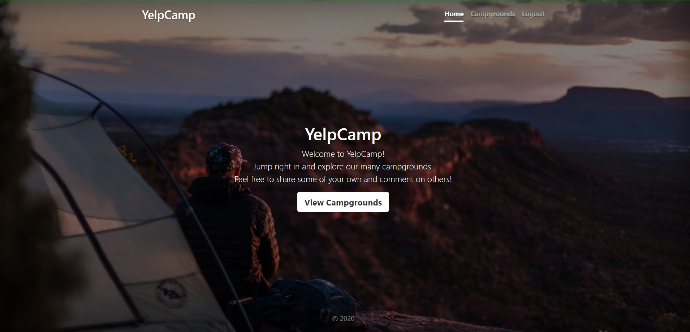
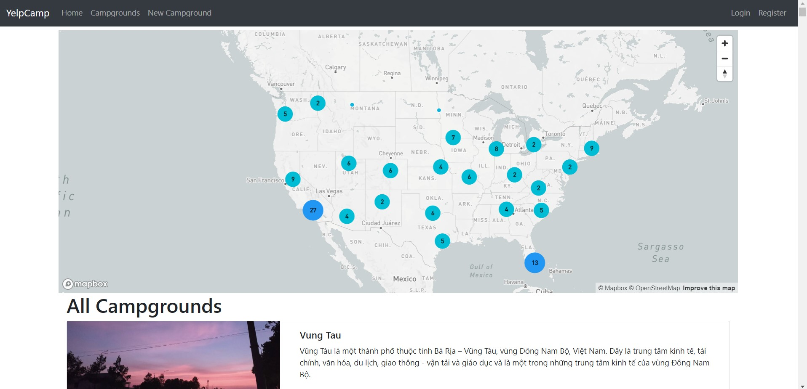
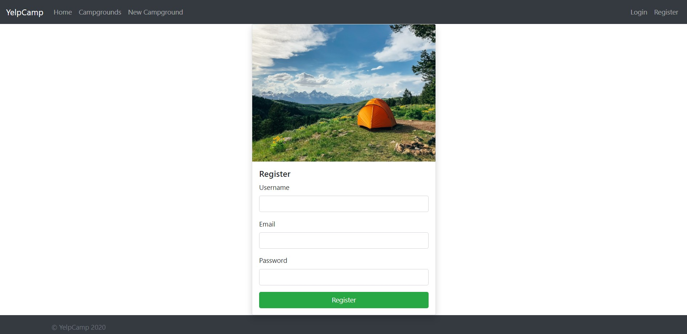

# Yelp Camp Web Application

This web application allows users to add, view, access, and rate campgrounds by location. It is based on "The Web Developer Bootcamp" by Colt Steele, but includes several modifications and bug fixes. The application leverages a variety of technologies and packages, such as:

- **Node.js with Express**: Used for the web server.
- **Bootstrap**: For front-end design.
- **Mapbox**: Provides a fancy cluster map.
- **MongoDB Atlas**: Serves as the database.
- **Passport package with local strategy**: For authentication and authorization.
- **Cloudinary**: Used for cloud-based image storage.
- **Helmet**: Enhances application security.
- ...

## Setup Instructions

To get this application up and running, you'll need to set up accounts with Cloudinary, Mapbox, and MongoDB Atlas. Once these are set up, create a `.env` file in the same folder as `app.js`. This file should contain the following configurations:

```sh
CLOUDINARY_CLOUD_NAME=[Your Cloudinary Cloud Name]
CLOUDINARY_KEY=[Your Cloudinary Key]
CLOUDINARY_SECRET=[Your Cloudinary Secret]
MAPBOX_TOKEN=[Your Mapbox Token]
DB_URL=[Your MongoDB Atlas Connection URL]
SECRET=[Your Chosen Secret Key] # This can be any value you prefer
```

After configuring the .env file, you can start the project by running:
```sh
docker compose up
```

## Application Screenshots




## Overview

This repository contains project code and supporting assets. It is maintained actively with periodic updates.

## Getting Started

1. Clone this repository.
2. Install dependencies as documented in the project files.
3. Run/build using the project-specific commands.

## Repository Structure

Key source code, configuration, and documentation are organized by folders at the repository root.

## Contribution Guidelines

Please open an issue for major changes and submit focused pull requests with clear descriptions.
